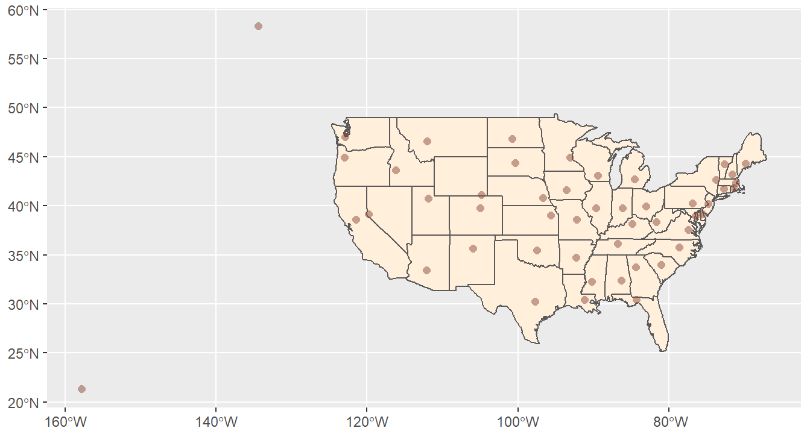
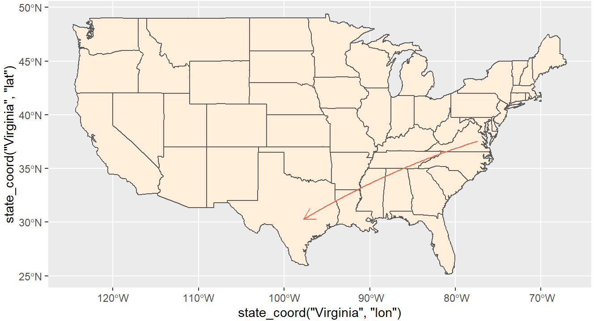
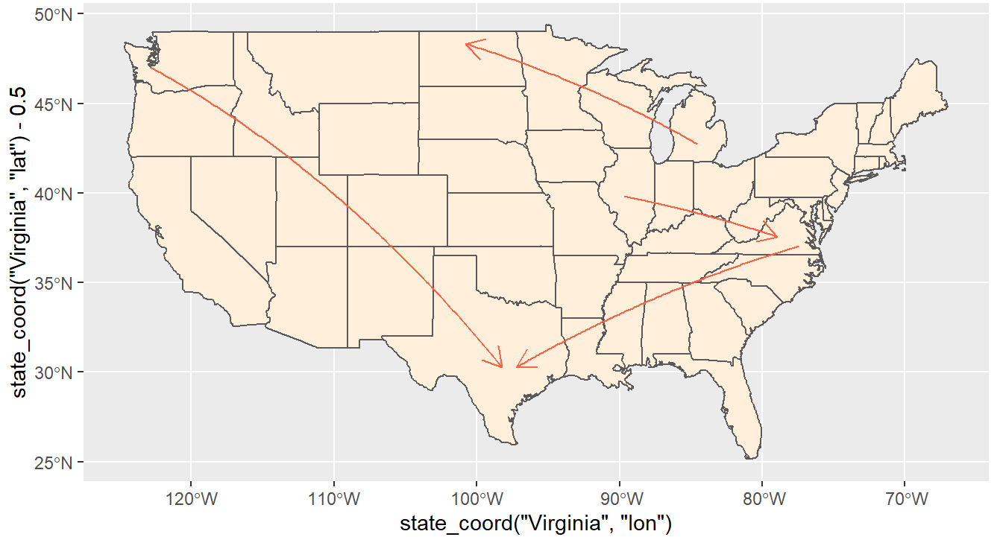
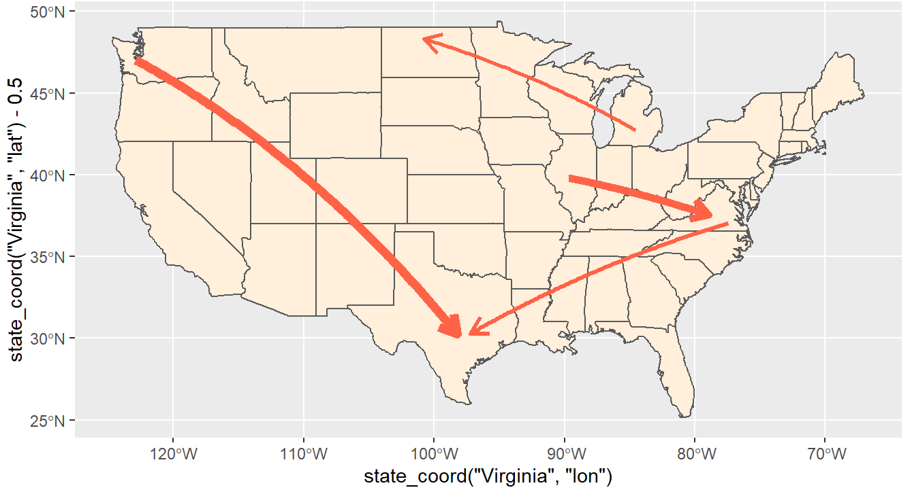
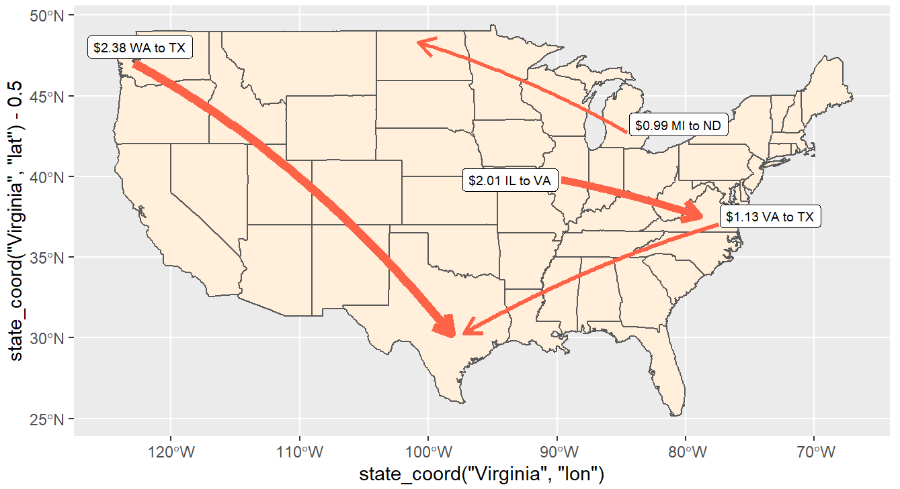
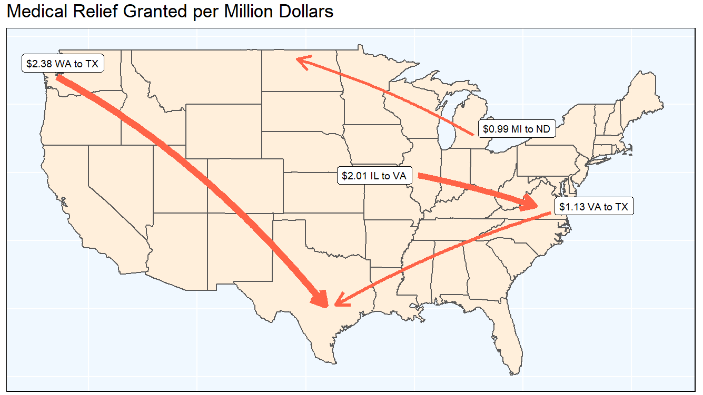

# How-to-Create-Directed-Network-Maps-in-R

This tutorial walks you through how to show state-to-state interactions--be it the flow of money aid given, policy diffusion, or migration patterns between states. It uses simulated data (`state_sim.csv`), which is included in the repository. (To see how the simulated data were created, see the script included in this repository: `State Money Simulated Data.R`).

# Tutorial 

## Set Up

### Load Libraries 

```{r}
library(maps)
library(tools)
library(lwgeom)
library(ggspatial)
library(rnaturalearth)
library(rnaturalearthdata)
library(rgeos)
library(sf)
library(tidyverse)
```

## Set Seed

### Load Data 

Here we are using the simulated data. For information and replication script for how this was created, see `State Money Simulated Data.R`.

If your data does not already include longitude and latitude of the state capitals, consider including them. The data `us_states_lonlat.txt` includes these.

```{r}
state_sim <- read_csv("Data/state_sim.csv")
```

### Load Functions 

The function `state_coord` will easily call either the longitude or latitude of the specified state. To use this function, use quotation marks to call the state (i.e. "Virginia") and specify whether the longitude or latitude of the state capital should be pulled (i.e. "lon").

```{r}
state_coord <- function(state_name, lon_or_lat) {
  state_sim %>%
    filter(money_from_state == state_name) %>%
    select(lon_or_lat) %>%
    as.matrix() %>%
    as.vector()
}
```

The function `state_money` will pull how much money the first specified state sent to the second specified state. If we would like to know how much money Virginia granted to Texas, we specify `state_money("Virginia", "Texas")`.

```{r}
state_money <- function(state_from, state_to) {
  state_sim %>%
    filter(money_from_state == state_from) %>%
    select(state_to) %>%
    as.matrix() %>%
    as.vector()
}
```

### Set up Maps 

First, we want to establish our map data. In this case, we want states. In this case, we are focusing on the contiguous United States. 
```{r}
states <- st_as_sf(maps::map("state", plot = FALSE, fill = TRUE))

states <- cbind(states, st_coordinates(st_centroid(states)))

states$ID <- toTitleCase(states$ID)
```

For instances where we wish to also plot Alaska and Hawaii, we can use the maps from the package `rnaturalearth`. In this case, it is important to return the class as `sf` to be compatible with the library from which we are largely drawing to create these maps. 

```{r}
all_states <- ne_states(country = "united states of america", returnclass = "sf")
```

### Additional Data Points

If, for instance, there are certain points you would like to highlight on the map, we can do this by creating an `sf` object that will easily layer on our map. In this case, I have selected the state capitals. 

```{r}
sites <- st_as_sf(
  data.frame(longitude = state_sim$lon,
             latitude = state_sim$lat),
  coords = c("longitude", "latitude"),
  crs = 4326, #the projection we want to use
  agr = "constant"
)
```

## Plot Maps

Plotting maps with `sf` is pretty similar to using `ggplot`, with some notable differences. 

First, let's plot a simple map of the US. If we use the `states` map data as our data, we see that the general structure of a simple map follows the `ggplot` grammar. Note that we must add `geom_sf()` as our map layer.  

```{r}
states %>% 
  ggplot() +
  geom_sf() 
```


If we wish to change any element of the US map, we can do so within `geom_sf()`. In this case, we can color the entire map. 

```{r}
states %>% 
  ggplot() +
  geom_sf(fill = "antiquewhite1")
```


### Adding Key Points 

Recall that we created an `sf` data frame for our key places, or `sites`, of interest. In this case, it was of each state capital. Here, we can take that data frame and add the points to our map, again using `geom_sf`

```{r}
states %>% 
  ggplot() +
  geom_sf(fill = "antiquewhite1") + 
 geom_sf(data = sites, size = 2, shape = 16, color = "salmon4", alpha = 0.5)
```



We see that Alaska and Hawaii's capitals have been plotted in the correct places on the map, but there is no data for the state! Here is an example where we might want to use the full US map, instead of the contiguous United States. 

As such, we simple replace the `states` data with `all_states`. Then, we see that the states geography is also graphed! In this case, we must also specify the full map coordinates, so that it is zoomed in enough for us to see. This takes a bit of trial and error (and googling). Here, we use the 2163 projection. 

```{r}
all_states %>% 
  ggplot() +
  geom_sf(fill = "antiquewhite1") + 
 geom_sf(data = sites, size = 2, shape = 16, color = "salmon4", alpha = 0.5) +
  coord_sf(crs = st_crs(2163), xlim = c(-6000000, 2500000))
```


### Mapping Directed Networks

Let's say we are interested in patterns between states. This could be state money sent to other states, migration patterns, or policy diffusion. This is done through specifying lines to and from different states. In order to do this, we use the function `geom_spatial_segment` from the package `ggspatial`. 

```{r}
states %>%
  ggplot() +
  geom_sf(fill = "antiquewhite1") +
  geom_spatial_segment(
    aes(
      #use our `state_coord` fx for state locations 
      x = state_coord("Virginia", "lon"), 
      y = state_coord("Virginia", "lat"),
      xend = state_coord("Texas", "lon"),
      yend = state_coord("Texas", "lat"),
    ),
    color = "tomato",
    crs = 4326,
    arrow = grid::arrow(length = unit(0.15, "inches"))
  )
```


Now, if we wish to add additional lines, we can repeat this process. 

```{r}
states %>% 
  ggplot() +
  geom_sf(data = states, fill = "antiquewhite1") +
  geom_spatial_segment(
    aes(
      x = state_coord("Virginia", "lon"),
      y = state_coord("Virginia", "lat"),
      xend = state_coord("Texas", "lon"),
      yend = state_coord("Texas", "lat")
    ),
    color = "tomato",
    crs = 4326,
    arrow = grid::arrow(length = unit(0.15, "inches"))
  ) +
  geom_spatial_segment(
    aes(
      x = state_coord("Washington", "lon"),
      y = state_coord("Washington", "lat"),
      xend = state_coord("Texas", "lon"),
      yend = state_coord("Texas", "lat"),
    ),
    color = "tomato",
    crs = 4326,
    arrow = grid::arrow(length = unit(0.15, "inches"))
  ) +
  geom_spatial_segment(
    aes(
      x = state_coord("Illinois", "lon"),
      y = state_coord("Illinois", "lat"),
      xend = state_coord("Virginia", "lon"),
      yend = state_coord("Virginia", "lat")
    ),
    color = "tomato",
    crs = 4326,
    arrow = grid::arrow(length = unit(0.15, "inches"))
  ) +
  geom_spatial_segment(
    aes(
      x = state_coord("Michigan", "lon"),
      y = state_coord("Michigan", "lat"),
      xend = state_coord("North Dakota", "lon"),
      yend = state_coord("North Dakota", "lat")
    ),
    color = "tomato",
    crs = 4326,
    arrow = grid::arrow(length = unit(0.15, "inches"))
  ) 
```


However, some of the arrow points bleed into each other. This is because we are using the specific capital coordinates each time. This part takes a bit of trial and error, but you can adjust the `geom_spatial_segments` to start slightly off from other arrows. This helps make the arrows each look more distinct from the other arrows. We could use `jitter` however, we general want to dictate how the arrows should be adjusted (e.g. moving the start of the VA to TX arrow slightly lower and the end point slightly to the right).

```{r}
states %>% 
  ggplot() +
  geom_sf(data = states, fill = "antiquewhite1") +
  geom_spatial_segment(
    aes(
      x = state_coord("Virginia", "lon"),
      y = state_coord("Virginia", "lat") - 0.5, #manual segment adjustment
      xend = state_coord("Texas", "lon") + 0.5,
      yend = state_coord("Texas", "lat")
    ),
    color = "tomato",
    crs = 4326,
    arrow = grid::arrow(length = unit(0.15, "inches"))
  ) +
  geom_spatial_segment(
    aes(
      x = state_coord("Washington", "lon"),
      y = state_coord("Washington", "lat"),
      xend = state_coord("Texas", "lon") - 0.5,
      yend = state_coord("Texas", "lat"),
    ),
    color = "tomato",
    crs = 4326,
    arrow = grid::arrow(length = unit(0.15, "inches"))
  ) +
  geom_spatial_segment(
    aes(
      x = state_coord("Illinois", "lon"),
      y = state_coord("Illinois", "lat"),
      xend = state_coord("Virginia", "lon") - 1.5,
      yend = state_coord("Virginia", "lat")
    ),
    color = "tomato",
    crs = 4326,
    arrow = grid::arrow(length = unit(0.15, "inches"))
  ) +
  geom_spatial_segment(
    aes(
      x = state_coord("Michigan", "lon"),
      y = state_coord("Michigan", "lat"),
      xend = state_coord("North Dakota", "lon"),
      yend = state_coord("North Dakota", "lat") + 1.5
    ),
    color = "tomato",
    crs = 4326,
    arrow = grid::arrow(length = unit(0.15, "inches"))
  ) 
```


Not only can we specify the starting and ending points of the arrow, we can also indicate other information with arrow characteristics. For instance, we could assign line thickness to amount of money granted. In this case, thicker lines correspond to higher dollar values and thinner lines correspond to lower dollar values.

```{r}
states %>% 
  ggplot() +
  geom_sf(data = states, fill = "antiquewhite1") +
  geom_spatial_segment(
    aes(
      x = state_coord("Virginia", "lon"),
      y = state_coord("Virginia", "lat") - 0.5, #manual segment adjustment
      xend = state_coord("Texas", "lon") + 0.5,
      yend = state_coord("Texas", "lat")
    ),
    color = "tomato",
    size = state_money("Virginia", "Texas"), #adding funds granted data using our function
    crs = 4326,
    arrow = grid::arrow(length = unit(0.15, "inches"))
  ) +
  geom_spatial_segment(
    aes(
      x = state_coord("Washington", "lon"),
      y = state_coord("Washington", "lat"),
      xend = state_coord("Texas", "lon") - 0.5,
      yend = state_coord("Texas", "lat"),
    ),
    color = "tomato",
    size = state_money("Washington", "Texas"),
    crs = 4326,
    arrow = grid::arrow(length = unit(0.15, "inches"))
  ) +
  geom_spatial_segment(
    aes(
      x = state_coord("Illinois", "lon"),
      y = state_coord("Illinois", "lat"),
      xend = state_coord("Virginia", "lon") - 1.5,
      yend = state_coord("Virginia", "lat")
    ),
    color = "tomato",
    size = state_money("Illinois", "Virginia"),
    crs = 4326,
    arrow = grid::arrow(length = unit(0.15, "inches"))
  ) +
  geom_spatial_segment(
    aes(
      x = state_coord("Michigan", "lon"),
      y = state_coord("Michigan", "lat"),
      xend = state_coord("North Dakota", "lon"),
      yend = state_coord("North Dakota", "lat") + 1.5
    ),
    color = "tomato",
    size = state_money("Michigan", "North Dakota"),
    crs = 4326,
    arrow = grid::arrow(length = unit(0.15, "inches"))
  ) 

```


#### Labelling Directed Networks

Next, we want to add the labels. There are a number of ways to accomplish this. One could set the label to be in the middle--geographically--of the line segment. It could also be at the beginning or at the ending point of the line segment. In this example, I place them at the beginning. 

As with `geom_line_segment`, in `geom_lable`, we specify the x and y coordinates of where we want the label to be. Since I wish for it to be at the start of the directed network (i.e. the state the money is coming from), I select the coordinates of the state sending the money. If you wanted to place the label in between the states, you could take the average longitude and latitude coordinates between the starting and end points and use those as your x and y values. 

Again, I manually adjust the longitude and latitude of the labels for ease of interpretation. This takes a bit of trial and error. 


```{r}
states %>% 
  ggplot() +
  geom_sf(data = states, fill = "antiquewhite1") +
  geom_spatial_segment(
    aes(
      x = state_coord("Virginia", "lon"),
      y = state_coord("Virginia", "lat") - 0.5, #manual segment adjustment
      xend = state_coord("Texas", "lon") + 0.5,
      yend = state_coord("Texas", "lat")
    ),
    color = "tomato",
    size = state_money("Virginia", "Texas"), #adding funds granted data using our function
    crs = 4326,
    arrow = grid::arrow(length = unit(0.15, "inches"))
  ) +
  geom_spatial_segment(
    aes(
      x = state_coord("Washington", "lon"),
      y = state_coord("Washington", "lat"),
      xend = state_coord("Texas", "lon") - 0.5,
      yend = state_coord("Texas", "lat"),
    ),
    color = "tomato",
    size = state_money("Washington", "Texas"),
    crs = 4326,
    arrow = grid::arrow(length = unit(0.15, "inches"))
  ) +
  geom_spatial_segment(
    aes(
      x = state_coord("Illinois", "lon"),
      y = state_coord("Illinois", "lat"),
      xend = state_coord("Virginia", "lon") - 1.5, 
      yend = state_coord("Virginia", "lat")
    ),
    color = "tomato",
    size = state_money("Illinois", "Virginia"),
    crs = 4326,
    arrow = grid::arrow(length = unit(0.15, "inches"))
  ) +
  geom_spatial_segment(
    aes(
      x = state_coord("Michigan", "lon"),
      y = state_coord("Michigan", "lat"),
      xend = state_coord("North Dakota", "lon"),
      yend = state_coord("North Dakota", "lat") + 1.5
    ),
    color = "tomato",
    size = state_money("Michigan", "North Dakota"),
    crs = 4326,
    arrow = grid::arrow(length = unit(0.15, "inches"))
  ) +
  geom_label(aes(
    label = "$1.13 VA to TX", #what the label should say
    x = state_coord("Virginia", "lon") + 4, #manual label adjustment
    y = state_coord("Virginia", "lat")
  ), size = 2.5) +
  geom_label(aes(
    label = "$2.38 WA to TX",
    x = state_coord("Washington", "lon") + 0.5,
    y = state_coord("Washington", "lat") + 1
  ), size = 2.5) +
  geom_label(aes(
    label = "$2.01 IL to VA",
    x = state_coord("Illinois", "lon")-4,
    y = state_coord("Illinois", "lat")
  ), size = 2.5) +
  geom_label(aes(
    label = "$0.99 MI to ND",
    x = state_coord("Michigan", "lon") + 4,
    y = state_coord("Michigan", "lat") + 0.5
  ), size = 2.5) 
```


### Plot Features

Next, we will clean up the plot. We can remove the x and y axis in this case, because it is clear that they are for longitude and latitude. We can also remove the tick marks associated with the longitude and latitudes. Moreover, we can add a color to the back panel. Lastly, we can include a title for the map.

```{r}

states %>% 
  ggplot() +
  geom_sf(data = states, fill = "antiquewhite1") +
  geom_spatial_segment(
    aes(
      x = state_coord("Virginia", "lon"),
      y = state_coord("Virginia", "lat") - 0.5, #manual segment adjustment
      xend = state_coord("Texas", "lon") + 0.5,
      yend = state_coord("Texas", "lat")
    ),
    color = "tomato",
    size = state_money("Virginia", "Texas"), #adding funds granted data using our function
    crs = 4326,
    arrow = grid::arrow(length = unit(0.15, "inches"))
  ) +
  geom_spatial_segment(
    aes(
      x = state_coord("Washington", "lon"),
      y = state_coord("Washington", "lat"),
      xend = state_coord("Texas", "lon") - 0.5,
      yend = state_coord("Texas", "lat"),
    ),
    color = "tomato",
    size = state_money("Washington", "Texas"),
    crs = 4326,
    arrow = grid::arrow(length = unit(0.15, "inches"))
  ) +
  geom_spatial_segment(
    aes(
      x = state_coord("Illinois", "lon"),
      y = state_coord("Illinois", "lat"),
      xend = state_coord("Virginia", "lon") - 1.5, 
      yend = state_coord("Virginia", "lat")
    ),
    color = "tomato",
    size = state_money("Illinois", "Virginia"),
    crs = 4326,
    arrow = grid::arrow(length = unit(0.15, "inches"))
  ) +
  geom_spatial_segment(
    aes(
      x = state_coord("Michigan", "lon"),
      y = state_coord("Michigan", "lat"),
      xend = state_coord("North Dakota", "lon"),
      yend = state_coord("North Dakota", "lat") + 1.5
    ),
    color = "tomato",
    size = state_money("Michigan", "North Dakota"),
    crs = 4326,
    arrow = grid::arrow(length = unit(0.15, "inches"))
  ) +
  geom_label(aes(
    label = "$1.13 VA to TX",
    x = state_coord("Virginia", "lon") + 4, #manual label adjustment
    y = state_coord("Virginia", "lat")
  ), size = 2.5) +
  geom_label(aes(
    label = "$2.38 WA to TX",
    x = state_coord("Washington", "lon") + 0.5,
    y = state_coord("Washington", "lat") + 1
  ), size = 2.5) +
  geom_label(aes(
    label = "$2.01 IL to VA",
    x = state_coord("Illinois", "lon")-4,
    y = state_coord("Illinois", "lat")
  ), size = 2.5) +
  geom_label(aes(
    label = "$0.99 MI to ND",
    x = state_coord("Michigan", "lon") + 4,
    y = state_coord("Michigan", "lat") + 0.5
  ), size = 2.5) +
 theme(
    panel.background = element_rect(fill = "aliceblue"),
    panel.border = element_rect(fill = NA)
  ) +
  theme(
    axis.title = element_blank(),
    axis.text = element_blank(),
    axis.ticks = element_blank()
  ) +
  ggtitle("Medical Relief Granted per Million Dollars")
  
```
And here is our final map! 


